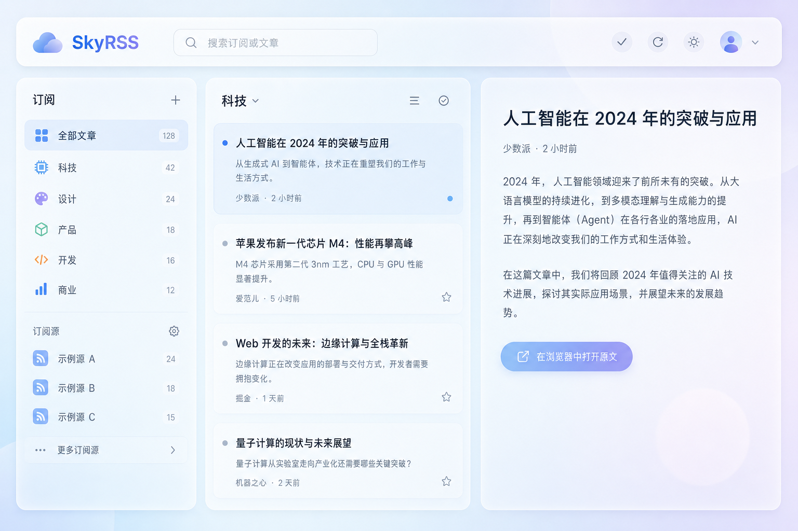
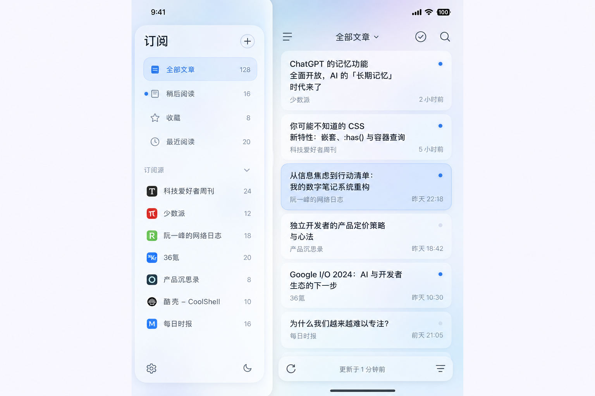

# SkyRSS

[](https://nextjs.org)
[](https://react.dev)
[](https://tailwindcss.com)
[](https://www.typescriptlang.org)
[](https://clerk.com)

**SkyRSS** 是一款现代化的 RSS/Atom 阅读器，采用玻璃拟态（Glassmorphism）UI 设计，支持用户认证、订阅管理、智能阅读和全文缓存。所有订阅源的拉取与解析在 Next.js 服务端完成，有效避免跨域问题并提升阅读体验。

> **EN:** **SkyRSS** is a modern RSS/Atom reader with a glassmorphism UI. It features user authentication, feed management, smart reading, and intelligent caching. All feed fetching and parsing happen on the Next.js server to eliminate CORS issues and improve the reading experience.

---

## 截图 · Screenshots

| 桌面端（三栏） · Desktop (three columns) | 窄屏 / 移动端 · Narrow / mobile |
| --- | --- |
|  |  |

---

## 核心功能 · Features

### 阅读体验
- **三栏布局**：左侧订阅源导航、中间条目列表、右侧文章摘要与原文链接
- **智能分组**：支持按条目的分类（categories）分组展示
- **全文渲染**：支持 `content:encoded` 等富文本内容，自动清洗并优化展示
- **主题切换**：支持亮色/暗色主题切换，偏好设置持久化
- **响应式设计**：桌面端三栏布局，移动端自适应单栏视图

### 订阅管理
- **快速添加**：粘贴 RSS/Atom 链接，自动校验并去重
- **智能纠错**：自动修正常见协议笔误（如 `htts://` → `https://`）
- **编辑功能**：重命名显示标题、删除订阅
- **一键刷新**：对选中的订阅源重新拉取最新内容

### 数据持久化
- **用户系统**：基于 Clerk 实现完整的用户认证
- **云端同步**：订阅列表和阅读状态存储在数据库，支持多设备同步
- **离线可用**：关键数据本地缓存，网络恢复后自动同步

### 性能优化
- **智能缓存**：请求缓存 TTL 3 分钟，避免频繁拉取相同内容
- **虚拟滚动**：长列表使用虚拟滚动，保持 60fps 流畅度
- **骨架屏加载**：加载时显示骨架屏，提升感知性能
- **预取优化**：浏览器空闲时预取可能需要的数据

---

## 技术栈 · Tech Stack

| 类别 · Category | 技术选型 · Choice |
| --- | --- |
| **框架 · Framework** | Next.js 16 (App Router) + React 19 |
| **语言 · Language** | TypeScript 5 |
| **样式 · Styling** | Tailwind CSS 4 + PostCSS |
| **认证 · Authentication** | Clerk (@clerk/nextjs) |
| **数据库 · Database** | Neon Postgres (@neondatabase/serverless) |
| **ORM** | Drizzle ORM (drizzle-kit, drizzle-orm) |
| **RSS 解析 · Parsing** | rss-parser |
| **校验 · Validation** | Zod |
| **HTML 清洗 · Sanitization** | sanitize-html |
| **数学公式 · Math** | KaTeX (@types/katex) |

---

## 环境要求 · Requirements

- **Node.js**: 20 LTS 或更高版本
- **包管理器**: npm / yarn / pnpm
- **必需账户**:
  - [Clerk](https://clerk.com) 账户（用于用户认证）
  - [Neon](https://neon.tech) 账户（用于 PostgreSQL 数据库）

---

## 快速开始 · Quick Start

### 1. 克隆项目

```bash
git clone <repository-url>
cd <project-directory>
```

### 2. 安装依赖

```bash
npm install
```

### 3. 配置环境变量

复制环境变量示例文件：

```bash
cp .env.example .env.local
```

编辑 `.env.local` 文件，填入以下配置：

```env
# Clerk 认证（https://dashboard.clerk.com）
NEXT_PUBLIC_CLERK_PUBLISHABLE_KEY=pk_test_xxx
CLERK_SECRET_KEY=sk_test_xxx
CLERK_WEBHOOK_SIGNING_SECRET=whsec_xxx

# Neon PostgreSQL 数据库
DATABASE_URL=postgresql://xxx@xxx.xxx.neon.tech/xxx?sslmode=require
```

> **获取配置说明**：
> - **Clerk**: 在 [Clerk Dashboard](https://dashboard.clerk.com) 创建应用，复制 Publishable Key 和 Secret Key
> - **Neon**: 在 [Neon Console](https://console.neon.tech) 创建数据库，复制 Connection String（建议使用 pooled 模式）

### 4. 初始化数据库

```bash
npm run db:push
```

或使用迁移：

```bash
npm run db:migrate
```

### 5. 启动开发服务器

```bash
npm run dev
```

浏览器访问 [http://localhost:3000](http://localhost:3000)

---

## 可用命令 · Available Scripts

| 命令 · Command | 说明 · Description |
| --- | --- |
| `npm run dev` | 启动开发服务器（热重载） |
| `npm run build` | 构建生产版本（含数据库迁移） |
| `npm run start` | 启动生产服务器 |
| `npm run lint` | ESLint 代码检查 |
| `npm run db:generate` | 生成 Drizzle 数据库迁移文件 |
| `npm run db:migrate` | 执行数据库迁移 |
| `npm run db:push` | 直接推送 schema 到数据库（开发环境） |
| `npm run db:studio` | 启动 Drizzle Studio 可视化数据库管理工具 |

---

## 项目结构 · Project Structure

```
/workspace
├── app/                          # Next.js App Router 目录
│   ├── api/                      # API 路由
│   │   ├── rss/route.ts          # RSS 拉取与解析接口
│   │   ├── clerk-webhooks/       # Clerk 事件处理
│   │   └── user-feeds/           # 用户订阅 CRUD 接口
│   ├── page.tsx                  # 首页入口
│   ├── layout.tsx                # 根布局（含 Providers）
│   ├── globals.css               # 全局样式（含玻璃拟态组件）
│   └── animations.css            # 动画系统定义
├── components/                   # React 组件
│   ├── reader/                   # 阅读器核心组件
│   │   ├── ReaderApp.tsx         # 主应用容器
│   │   ├── ReaderSidebar.tsx     # 订阅源侧边栏
│   │   ├── ArticleListColumn.tsx # 文章列表
│   │   └── ArticleReaderColumn.tsx # 文章阅读区
│   └── ui/                       # UI 基础组件
│       ├── glass.tsx             # 玻璃拟态组件（Button, Input, Panel）
│       └── skeleton.tsx          # 骨架屏组件
├── hooks/                        # React Hooks
│   ├── useFeeds.ts               # 订阅源状态管理
│   └── useReaderLibrary.ts       # 阅读器库管理
├── lib/                          # 工具函数与业务逻辑
│   ├── fetch-rss-item-view.ts    # RSS 数据获取
│   ├── merge-feed-items.ts       # 条目合并逻辑
│   ├── sanitize-article-html.ts  # HTML 清洗
│   ├── normalize-feed-url.ts     # URL 规范化
│   └── cache.ts                  # 请求缓存
├── db/                           # 数据库相关
│   ├── schema.ts                 # Drizzle schema 定义
│   └── index.ts                  # 数据库连接
├── drizzle/                      # 数据库迁移文件
├── types/                        # TypeScript 类型定义
│   └── rss.ts                    # RSS 相关类型
└── scripts/                      # 构建脚本
    └── prebuild.cjs              # 构建前预处理脚本
```

---

## API 参考 · API Reference

### `GET /api/rss?url=<编码后的订阅地址>`

拉取并解析 RSS/Atom 订阅源。

**请求参数**：
- `url` (必需): 订阅源的绝对 URL（仅支持 `http` 或 `https`）

**响应字段**：
```typescript
interface RssFeedResponse {
  feed: {
    url: string;
    title: string;
    link?: string;
    description?: string;
  };
  items: RssItem[];
}

interface RssItem {
  id: string;
  title: string;
  link: string;
  published?: string;
  author?: string;
  contentSnippet?: string;  // 约 2000 字符
  contentHtml?: string;     // 完整 HTML（已清洗，上限 200,000 字符）
  categories?: string[];
}
```

**状态码**：
- `200`: 成功
- `400`: 参数错误（URL 非法或非 http/https 协议）
- `502`: 拉取或解析失败（返回 `{ "error": "错误信息" }`）

**限制**：
- 请求超时：10 秒
- 最大条目数：50 条
- 单条内容片段：约 2000 字符
- 全文 HTML 上限：约 200,000 字符

---

## 部署 · Deployment

### 部署到 Vercel

1. **推送代码**：将代码推送到 GitHub / GitLab

2. **导入项目**：登录 [Vercel](https://vercel.com) → **Add New Project** → 导入仓库

3. **配置环境变量**：在 Vercel 项目设置中添加以下环境变量：
   - `NEXT_PUBLIC_CLERK_PUBLISHABLE_KEY`
   - `CLERK_SECRET_KEY`
   - `CLERK_WEBHOOK_SIGNING_SECRET`
   - `DATABASE_URL`

   > **重要**：确保 `DATABASE_URL` 对 **Production** 和 **Preview** 环境都勾选 **"Expose to Build"**，否则构建会失败

4. **框架设置**：
   - Framework Preset: **Next.js**
   - Build Command: `next build`（默认）
   - Output Directory: （留空）
   - Install Command: `npm install`（默认）

5. **部署**：点击 **Deploy**，等待构建完成

6. **自定义域名**（可选）：在 **Settings → Domains** 添加域名

### 生产环境注意事项

- **User-Agent 限制**：某些订阅源可能拦截非常见 User-Agent，导致拉取失败
- **TLS/证书要求**：确保订阅源使用有效的 HTTPS 证书
- **IP 限制**：部分服务可能对 Vercel 的出口 IP 有限制
- **超时处理**：生产环境的网络延迟可能更高，10 秒超时可能触发

---

## 数据库 · Database

本项目使用 **Drizzle ORM** 管理数据库 schema 和迁移。

### Schema 文件

- `db/schema.ts`: 定义所有数据表结构
- `drizzle/`: 自动生成的迁移 SQL 文件

### 常用命令

```bash
# 开发环境：直接推送 schema（快速迭代）
npm run db:push

# 生产环境：生成迁移文件后审查
npm run db:generate
npm run db:migrate

# 可视化数据库管理
npm run db:studio
```

### 数据表

- `users`: 用户信息（与 Clerk 同步）
- `feeds`: 订阅源
- `feed_items`: 条目缓存
- `user_feed_subscriptions`: 用户订阅关系

---

## 开发指南 · Development

### 代码风格

- 使用 TypeScript 严格模式
- 遵循 ESLint 配置（`eslint.config.mjs`）
- 组件使用函数式写法 + Hooks
- 避免使用内联函数作为 React key

### 添加新功能

1. 创建功能分支：
   ```bash
   git checkout -b feature/your-feature-name
   ```

2. 开发完成后运行检查：
   ```bash
   npm run lint
   npm run build
   ```

3. 提交代码：
   ```bash
   git add .
   git commit -m "feat: description"
   git push
   ```

---

## 性能优化 · Performance

详细的性能优化策略请参考 [性能优化指南](docs/PERFORMANCE.md)

### 关键指标

- **FCP**: < 1.8s
- **LCP**: < 2.5s
- **TTI**: < 3.8s
- **滚动 FPS**: 60fps

### 优化技术

- ✅ React.memo 浅比较优化
- ✅ useMemo / useCallback 记忆化
- ✅ 虚拟滚动（长列表）
- ✅ 请求缓存（TTL 3 分钟）
- ✅ 骨架屏加载
- ✅ CSS 动画（GPU 加速）
- ✅ 空闲预取

---

## 已知限制 · Known Limitations

1. **订阅源兼容性**：
   - 部分站点要求特定的 User-Agent
   - 需要登录的订阅源无法访问
   - 非标准 XML 格式可能解析失败

2. **单设备限制**（已解决）：
   - ~~数据仅存储在本地 localStorage~~
   - ✅ 现已升级为云端同步，支持多设备访问

3. **内容长度限制**：
   - 全文 HTML 超过 200,000 字符会被截断
   - 单条内容片段限制约 2000 字符

---

## 致谢 · Credits

- UI 设计灵感：玻璃拟态（Glassmorphism）设计风格
- 图标：使用系统默认字体图标
- 性能分析工具：Chrome DevTools, Lighthouse

---

## 许可证 · License

[MIT License](LICENSE)

---

## 贡献 · Contributing

欢迎提交 Issue 和 Pull Request！

1. Fork 本仓库
2. 创建特性分支 (`git checkout -b feature/AmazingFeature`)
3. 提交更改 (`git commit -m 'Add some AmazingFeature'`)
4. 推送到分支 (`git push origin feature/AmazingFeature`)
5. 创建 Pull Request

---
## 希望你喜欢！

- Star 趋势  [](https://github.com/Zyz555444/SkyRSS/stargazers)

[](https://github.com/Zyz555444/SkyRSS/stargazers)

**📡 Happy Reading with SkyRSS!**
